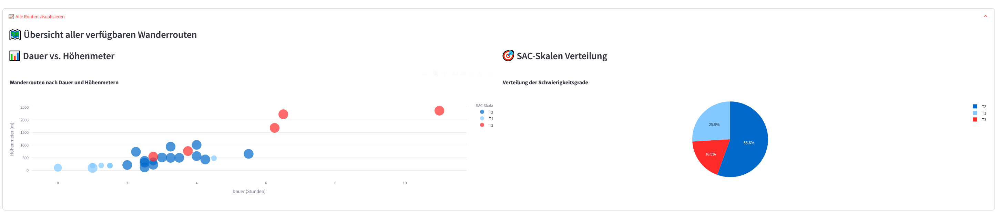
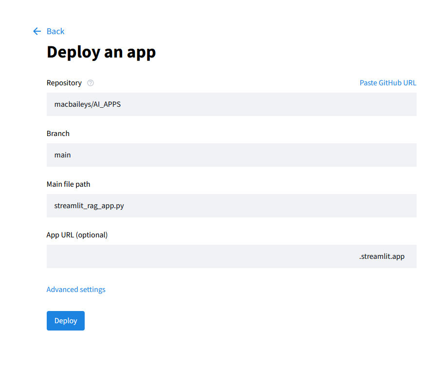
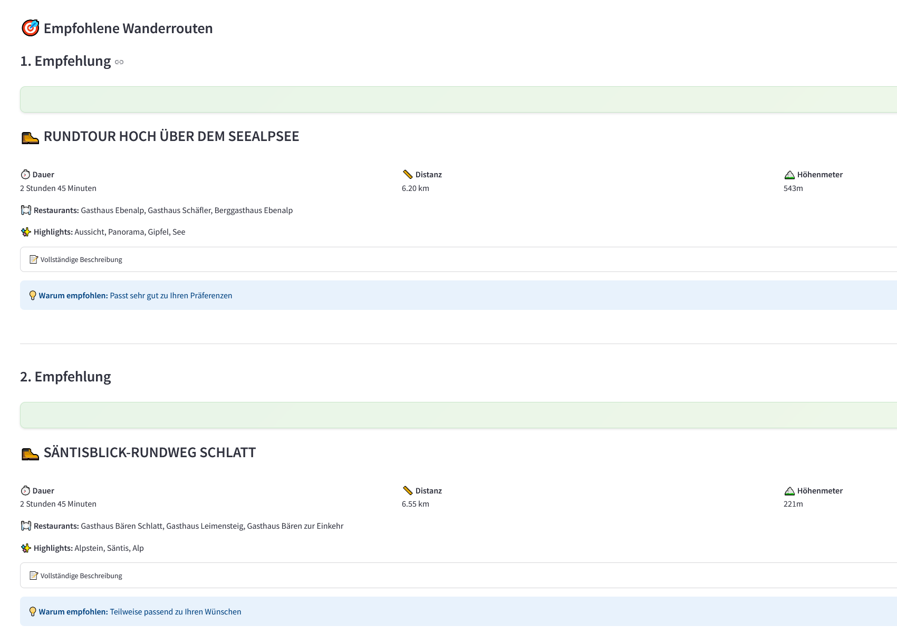

# 🏔️ RAG-System für Appenzeller Wanderungen

## Projekt-Beschreibung

Dieses Projekt hilft, personalisierte Wanderempfehlungen für die Region Appenzell zu finden. Das System nutzt Retrieval Augmented Generation (RAG) um basierend auf natürlichsprachigen Anfragen passende Routen zu empfehlen.

### Name & URL

| Name | URL |
|------|-----|
| Streamlit Web-App | [Streamlit App](https://macbaileys-ai-apps-app-r9y4ql.streamlit.app/) |
| GitHub Repository | [Repository](https://github.com/macbaileys/AI_APPS) |
| PDF Datenquelle | [Appenzell Wanderungen PDF](PDFs/Appenzell_Wanderungen.pdf) |

## Datenquellen und Pre-Processing

| Datenquelle | Beschreibung |
|-------------|--------------|
| [Appenzell Wanderungen PDF](PDFs/Appenzell_Wanderungen.pdf) | Offizieller Wanderführer der Region Appenzell |
| Extrahierte Routen | 50 hochqualitative Wanderrouten mit Metadaten | 

Datenquelle
PDF-Dokument: "Appenzell Wanderungen" mit detaillierten Wanderrouten
Format: PDF mit 81 Seiten Wanderinformationen

Das Ziel war es ursprünglich, eine Web-App zu erstellen, die die Wanderrouten aus mehrern PDF Dateien extrahiert (siehe [PDFs Ordner](https://github.com/macbaileys/AI_APPS/tree/main/PDFs)) extrahiert. Dies erwies sich aber als sehr schwierig, da die PDF Dateien sehr unstrukturiert und mit vielen unterschiedlichen Formaten und Stilen erstellt wurden. Die ZKB-Wanderguides waren jeweils anders strukturiert und hatten unterschiedliche Formate. Versucht hatte ich diese daten mithilfe von einem KI-Modell mit dem OpenAI API zu extrahieren, jedoch war das Ergebnis nicht zufriedenstellend. Ausserdem wollte ich ein "manuelles" pre-processing der Daten durchführen, um die Idee der Aufgabenstellung zu erfüllen.

 Schlussendlich entschied ich mich für Demo-Zwecke die Wanderungen aus dem Appenzell Wanderführer zu pre-processen und in einen JSON-Datensatz umzuwandeln. Dies geschah mit Hilfe von pdfplumber und PyPDF2. Die [appenzell_processor.py](https://github.com/macbaileys/AI_APPS/blob/main/appenzell_processor.py) Datei zeigt die Logik der Datenverarbeitung.

Es wird festgelegt, welche Seiten des PDFs relevant sind und welche übersprungen werden sollen. Das Skript öffnet dann das PDF und liest die relevanten Seiten. Für jede Seite wird der Text extrahiert und nach wichtigen Informationen wie Titel, Dauer, Distanz, Höhenmeter, Schwierigkeitsgrad (SAC-Skala), Restaurants und Highlights durchsucht (Doppelte oder ungültige Routen werden entfernt)
Die extrahierten Routen werden dann in einer JSON-Datei gespeichert. ([appenzell_routes_clean.json](https://github.com/macbaileys/AI_APPS/blob/main/appenzell_routes_clean.json))
Eine Übersicht der extrahierten Routen wird angezeigt, inklusive Statistiken und Beispielen.

## RAG-Verbesserungen
Implementiert das "Retrieval Augmented Generation" System, das die Routen aus der JSON-Datei lädt und die Such- und Empfehlungslogik enthält.

| Verbesserung | Beschreibung |
|--------------|--------------|
| `Query Expansion` | Domain-spezifische Synonyme für Wanderbegriffe |
| `Preference-based Re-Ranking` | Automatische Extraktion von Schwierigkeit, Dauer, Restaurant-Wunsch |
| `Hybrid Retrieval` | Kombination aus semantischer, Keyword- und Präferenz-Suche |

Query Expander: Erweitert Benutzeranfragen mit Synonymen und verwandten Begriffen, um die Suche zu verbessern.
Verwendet TF-IDF (Eigene Recherche) https://de.wikipedia.org/wiki/Tf-idf-Ma%C3%9F
um Routen zu finden, die inhaltlich zur Anfrage passen.
Keyword-Suche: Sucht nach Routen, die die gleichen Wörter wie die Anfrage enthalten.
Re-Ranking:
Präferenzabgleich: Ordnet die Ergebnisse basierend auf den Benutzerpräferenzen neu, z.B. Schwierigkeitsgrad, Dauer, Höhenmeter und Restaurantwunsch, generiert natürliche Sprachantworten, die die besten Routen basierend auf der Anfrage beschreiben und zeigt anschliessend die besten Routen mit detaillierten Informationen wie Dauer, Distanz, Schwierigkeitsgrad und Restaurants an.

## Chunking

Das Chunking wurde so gesehen simplifiziert, da ich nicht mit einer grossen Datenmenge gearbeitet habe. Von der Idee her könnte man das Chunking aber so beschreiben:

Chunking und Verarbeitungsschritte
Initialisierung:
Die Klasse AppenzellProcessor wird mit einer Konfiguration initialisiert, die angibt, welche Seiten des PDFs verarbeitet, übersprungen oder als Doppelseiten behandelt werden sollen. process_appenzell_pdf öffnet die angegebene PDF-Datei und durchläuft die in der Konfiguration definierten Seiten.
Sie überspringt Seiten, von denen bekannt ist, dass sie keine Wanderrouten enthalten, und verarbeitet Doppelseiten gemeinsam, falls angegeben.
Für jede relevante Seite oder Seitengruppe extrahiert die Methode extract_route_from_pages mit pdfplumber Text, der dann zu einem einzigen Textblock zusammengefasst wird.
Die clean_text-Methode entfernt unnötige Leerzeichen und unwesentliche Zeilen, um den Text für das Parsing vorzubereiten.

Die Methode parse_route_data extrahiert aus dem bereinigten Text spezifische Informationen über jede Wanderroute, wie Titel, Dauer, Entfernung, Höhengewinn/-verlust und mehr.

Nach der Verarbeitung aller Seiten bereinigt die Methode remove_duplicates die Liste der Routen, um sicherzustellen, dass keine Duplikate vorhanden sind.

Die verarbeiteten und bereinigten Routen werden in einer JSON-Datei, appenzell_routes_clean.json, zur weiteren Verwendung im RAG-System gespeichert.

## Auswahl des LLM

| Name | Link |
|------|------|
| Groq LLaMA 3 8B | [Groq API](https://groq.com/) |

Um das gelernte aus dem Modul trotzdem noch mit einem LLM zu verbessern, habe ich die [`groq_enhancement.py`](https://github.com/macbaileys/AI_APPS/blob/main/groq_enhancement.py) Datei erstellt. Dies Verwendet wie in der Übung das LLM von Groq durch meinen API-Key.
## Ablauf des Groq-Enhanced RAG-Systems:

### Initialisierung
- Ein Groq-Client wird initialisiert
- API-Schlüssel wird aus Umgebungsvariablen oder als Parameter bezogen

### Anfrageverarbeitung 
- Durchführung der normalen RAG-Suche bei Benutzeranfragen
- Ermittlung relevanter Suchergebnisse

### Antwortgenerierung
- `generate_groq_response`-Methode erstellt Kontext aus besten Suchergebnissen
- Verwendung von Groq AI für natürlichsprachige Antworten
- Definition eines System-Prompts für freundlichen Wanderführer-Charakter

### Demo-Funktion
- `demo_groq_enhancement` demonstriert das Groq-Enhanced RAG-System
- Beispielanfragen zur Veranschaulichung
- Überprüfung des GROQ_API_KEY
- System-Initialisierung

Die App für Groq läuft unter [`app.py`](https://github.com/macbaileys/AI_APPS/blob/main/app.py). Die manuelle App läuft unter [`streamlit_rag_app.py`](https://github.com/macbaileys/AI_APPS/blob/main/streamlit_rag_app.py)

## Auswahl von Vektorspeichern

### Semantische Suche mit Einbettungen
Die Klasse `SimpleEmbedding` in `rag_hiking_system.py` verwendet einen TF-IDF-basierten Ansatz zur Erstellung von Einbettungen für die semantische Suche. Dies ist eine einfache, aber effektive Methode zur Darstellung von Dokumenten als Vektoren auf der Grundlage der Termhäufigkeit und der inversen Dokumenthäufigkeit.

### Index-Erstellung
Die Klassen `SemanticRetriever` und `KeywordRetriever` erstellen Indizes für die Routen mit Hilfe semantischer bzw. schlagwortbasierter Ansätze. Diese Indizes ermöglichen eine effiziente Suche nach relevanten Routen auf der Grundlage von Benutzeranfragen.

### Abfrageerweiterung und Re-Ranking
- Die Klasse `QueryExpander` erweitert Benutzeranfragen mit domänenspezifischen Synonymen und Präferenzen und verbessert so die Abfragegenauigkeit
- Die `PreferenceReRanker`-Klasse ordnet die abgerufenen Ergebnisse auf der Grundlage der Benutzerpräferenzen neu ein und stellt sicher, dass die relevantesten Routen priorisiert werden

### Bewertung

#### Bewertungsrahmen
Die Klasse `RAGEvaluator` in `rag_evaluation.py` ist für die Bewertung der Leistung des RAG-Systems verantwortlich. Sie verwendet eine Reihe von vordefinierten Testanfragen mit erwarteten Eigenschaften, um die Genauigkeit und Relevanz des Systems zu bewerten.

#### Metriken
- **Verarbeitungszeit**: Misst, wie schnell das System eine Abfrage verarbeiten kann
- **Punktzahlen**: Umfasst semantische, Stichwort-, Präferenz- und Endbewertungen für jedes Ergebnis
- **Übereinstimmung der Präferenzen**: Bewertet, wie gut die Ergebnisse mit den erwarteten Präferenzen übereinstimmen (z. B. Schwierigkeitsgrad, Vorhandensein von Restaurants)
- **Relevanz-Bewertung**: Kombiniert Punkte und Präferenzabgleich zur Bewertung der Gesamtrelevanz

## Test-Methode

**Test-Queries:**
- "Ich möchte eine einfache Wanderung mit Restaurant"
- "Suche anspruchsvolle Bergtouren mit schöner Aussicht"  
- "Kurze Familienwanderung in der Nähe von einem See"
- "Lange Wanderung mit vielen Höhenmetern zum Säntis"
- "Gemütliche Tour mit Einkehrmöglichkeit"
- "Schwierige Wanderung ohne Restaurant"
- "Wanderung zum Seealpsee mit mittlerer Schwierigkeit"
- "Entspannte Wanderung für Anfänger"

## Deployment

Die Anwendung wurde mit Streamlit deployed. Benutzer können über die Web-Oberfläche Anfragen eingeben, die dann vom RAG-System verarbeitet werden, um passende Wanderrouten zu empfehlen.

### Screenshots

#### Benutzeroberfläche

#### Deployment-Architektur

#### Beispiel-Anfrage und Ergebnisse

Die App kann über zwei Wege gestartet werden:
- [`app.py`](https://github.com/macbaileys/AI_APPS/blob/main/app.py) - Groq-erweiterte Version
- [`streamlit_rag_app.py`](https://github.com/macbaileys/AI_APPS/blob/main/streamlit_rag_app.py) - Standard-Version

### Core-Komponenten

| Datei | Beschreibung |
|-------|--------------|
| [`rag_hiking_system.py`](https://github.com/macbaileys/AI_APPS/blob/main/rag_hiking_system.py) | Haupt-RAG Implementation |
| [`appenzell_processor.py`](https://github.com/macbaileys/AI_APPS/blob/main/appenzell_processor.py) | PDF-zu-JSON Pipeline |
| [`app.py`](https://github.com/macbaileys/AI_APPS/blob/main/app.py) oder [`streamlit_rag_app.py`](https://github.com/macbaileys/AI_APPS/blob/main/streamlit_rag_app.py)| Web-Interface |
| [`groq_enhancement.py`](https://github.com/macbaileys/AI_APPS/blob/main/groq_enhancement.py) | Optional LLM Integration |
| [`rag_evaluation.py`](https://github.com/macbaileys/AI_APPS/blob/main/rag_evaluation.py) | Evaluation Framework |
| [`appenzell_routes_clean.json`](https://github.com/macbaileys/AI_APPS/blob/main/appenzell_routes_clean.json) | Verarbeiteter Datensatz |

## Referenzen

- [Appenzell Wanderungen PDF](PDFs/Appenzell_Wanderungen.pdf) - Datenquelle
- [Streamlit Documentation](https://docs.streamlit.io/) - Web-Framework um die App zu deployen
- [Groq API](https://groq.com/) -  LLM Enhancement 